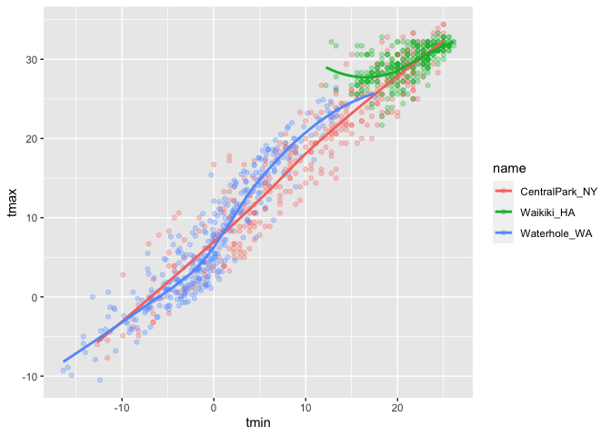
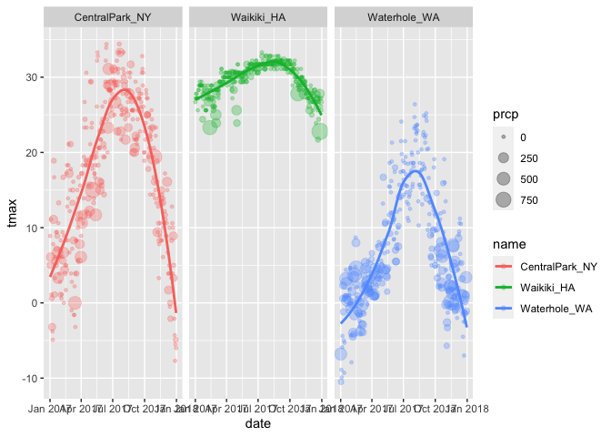

data_visualization_i
================
Mayuri Albal
2022-09-29

``` r
library(tidyverse)
```

    ## ── Attaching packages ─────────────────────────────────────── tidyverse 1.3.2 ──
    ## ✔ ggplot2 3.3.6      ✔ purrr   0.3.4 
    ## ✔ tibble  3.1.8      ✔ dplyr   1.0.10
    ## ✔ tidyr   1.2.0      ✔ stringr 1.4.1 
    ## ✔ readr   2.1.2      ✔ forcats 0.5.2 
    ## ── Conflicts ────────────────────────────────────────── tidyverse_conflicts() ──
    ## ✖ dplyr::filter() masks stats::filter()
    ## ✖ dplyr::lag()    masks stats::lag()

``` r
library (ggridges)
```

``` r
weather_df = 
  rnoaa::meteo_pull_monitors(
    c("USW00094728", "USC00519397", "USS0023B17S"),
    var = c("PRCP", "TMIN", "TMAX"), 
    date_min = "2017-01-01",
    date_max = "2017-12-31") %>%
  mutate(
    name = recode(
      id, 
      USW00094728 = "CentralPark_NY", 
      USC00519397 = "Waikiki_HA",
      USS0023B17S = "Waterhole_WA"),
    tmin = tmin / 10,
    tmax = tmax / 10) %>%
  select(name, id, everything())
```

    ## Registered S3 method overwritten by 'hoardr':
    ##   method           from
    ##   print.cache_info httr

    ## using cached file: ~/Library/Caches/R/noaa_ghcnd/USW00094728.dly

    ## date created (size, mb): 2022-09-08 10:10:02 (8.397)

    ## file min/max dates: 1869-01-01 / 2022-09-30

    ## using cached file: ~/Library/Caches/R/noaa_ghcnd/USC00519397.dly

    ## date created (size, mb): 2022-09-08 10:10:08 (1.697)

    ## file min/max dates: 1965-01-01 / 2020-02-29

    ## using cached file: ~/Library/Caches/R/noaa_ghcnd/USS0023B17S.dly

    ## date created (size, mb): 2022-09-08 10:10:10 (0.949)

    ## file min/max dates: 1999-09-01 / 2022-09-30

``` r
weather_df
```

    ## # A tibble: 1,095 × 6
    ##    name           id          date        prcp  tmax  tmin
    ##    <chr>          <chr>       <date>     <dbl> <dbl> <dbl>
    ##  1 CentralPark_NY USW00094728 2017-01-01     0   8.9   4.4
    ##  2 CentralPark_NY USW00094728 2017-01-02    53   5     2.8
    ##  3 CentralPark_NY USW00094728 2017-01-03   147   6.1   3.9
    ##  4 CentralPark_NY USW00094728 2017-01-04     0  11.1   1.1
    ##  5 CentralPark_NY USW00094728 2017-01-05     0   1.1  -2.7
    ##  6 CentralPark_NY USW00094728 2017-01-06    13   0.6  -3.8
    ##  7 CentralPark_NY USW00094728 2017-01-07    81  -3.2  -6.6
    ##  8 CentralPark_NY USW00094728 2017-01-08     0  -3.8  -8.8
    ##  9 CentralPark_NY USW00094728 2017-01-09     0  -4.9  -9.9
    ## 10 CentralPark_NY USW00094728 2017-01-10     0   7.8  -6  
    ## # … with 1,085 more rows

Making a Scatterplot

``` r
ggplot (weather_df, aes (x =tmin, y= tmax))
```

<!-- -->
Adding geometric point into the plot

``` r
ggplot (weather_df, aes (x =tmin, y= tmax)) +geom_point ()
```

    ## Warning: Removed 15 rows containing missing values (geom_point).

<!-- -->
Same scatterplot but different

``` r
weather_df %>%
  ggplot(aes(x = tmin, y = tmax)) + 
  geom_point()
```

    ## Warning: Removed 15 rows containing missing values (geom_point).

<!-- -->

``` r
weather_df %>%
  drop_na %>%
  ggplot(aes(x = tmin, y = tmax)) + 
  geom_point()
```

<!-- -->

Lets make the same plot but different

``` r
weather_scatterplot =
weather_df %>%
  drop_na () %>%
  ggplot(aes(x = tmin, y = tmax))

weather_scatterplot + geom_point ()
```

<!-- -->

\##Lets make fancier plots

``` r
weather_df %>%
  ggplot(aes(x = tmin, y = tmax)) + 
  geom_point(aes(color = name))
```

    ## Warning: Removed 15 rows containing missing values (geom_point).

<!-- -->

``` r
weather_df %>%
  ggplot(aes(x = tmin, y = tmax)) + 
  geom_point(aes(color = name))+
  geom_smooth()
```

    ## `geom_smooth()` using method = 'gam' and formula 'y ~ s(x, bs = "cs")'

    ## Warning: Removed 15 rows containing non-finite values (stat_smooth).

    ## Warning: Removed 15 rows containing missing values (geom_point).

<!-- -->

``` r
weather_df %>%
  ggplot(aes(x = tmin, y = tmax)) + 
  geom_point(aes(color = name))+
  geom_smooth (aes(color=name))
```

    ## `geom_smooth()` using method = 'loess' and formula 'y ~ x'

    ## Warning: Removed 15 rows containing non-finite values (stat_smooth).

    ## Warning: Removed 15 rows containing missing values (geom_point).

<!-- -->

``` r
weather_df %>%
  ggplot(aes(x = tmin, y = tmax, color= name)) + 
  geom_point(alpha = 0.3)+
  geom_smooth (se= FALSE)
```

    ## `geom_smooth()` using method = 'loess' and formula 'y ~ x'

    ## Warning: Removed 15 rows containing non-finite values (stat_smooth).

    ## Warning: Removed 15 rows containing missing values (geom_point).

<!-- -->
Maybe make seperate plots

``` r
weather_df %>%
  ggplot(aes(x = tmin, y = tmax, color= name)) + 
  geom_point(alpha = 0.3)+
  geom_smooth (se= FALSE)+
  facet_grid(.~name)
```

    ## `geom_smooth()` using method = 'loess' and formula 'y ~ x'

    ## Warning: Removed 15 rows containing non-finite values (stat_smooth).

    ## Warning: Removed 15 rows containing missing values (geom_point).

<!-- -->
‘tmax’ vs ‘tmin’ is boring, lets spice it up

``` r
weather_df %>%
  ggplot(aes(x = date, y = tmax,color= name)) + 
    geom_point ()+ 
  geom_point(alpha = 0.3)+
  geom_smooth (se= FALSE)+
  facet_grid(.~name)
```

    ## `geom_smooth()` using method = 'loess' and formula 'y ~ x'

    ## Warning: Removed 3 rows containing non-finite values (stat_smooth).

    ## Warning: Removed 3 rows containing missing values (geom_point).
    ## Removed 3 rows containing missing values (geom_point).

<!-- -->
Percipitation coloring

``` r
weather_df %>%
  ggplot(aes(x = date, y = tmax,color= prcp)) + 
    geom_point ()+ 
  geom_point(alpha = 0.3)+
  geom_smooth (se= FALSE)+
  facet_grid(.~name)
```

    ## `geom_smooth()` using method = 'loess' and formula 'y ~ x'

    ## Warning: Removed 3 rows containing non-finite values (stat_smooth).

    ## Warning: Removed 3 rows containing missing values (geom_point).
    ## Removed 3 rows containing missing values (geom_point).

<!-- -->

``` r
weather_df %>%
  ggplot(aes(x = date, y = tmax,color= name)) + 
  geom_point(aes(size= prcp),alpha = 0.3)+
  geom_smooth (se= FALSE)+
  facet_grid(.~name)
```

    ## `geom_smooth()` using method = 'loess' and formula 'y ~ x'

    ## Warning: Removed 3 rows containing non-finite values (stat_smooth).

    ## Warning: Removed 3 rows containing missing values (geom_point).

<!-- -->
Fix the axises

``` r
weather_df %>%
  ggplot(aes(x = date, y = tmax,color= name)) + 
  geom_point(aes(size= prcp),alpha = 0.3)+
  geom_smooth (se= FALSE)+
  facet_grid(.~name)+
  theme (axis.text.x = element_text(angle =90, vjust =0.5, hjust= 1))
```

    ## `geom_smooth()` using method = 'loess' and formula 'y ~ x'

    ## Warning: Removed 3 rows containing non-finite values (stat_smooth).

    ## Warning: Removed 3 rows containing missing values (geom_point).

<!-- -->

Some Quick Stuff

``` r
weather_df %>% 
  filter(name == "CentralPark_NY") %>% 
  mutate(
    tmax_fahr = tmax * (9 / 5) + 32,
    tmin_fahr = tmin * (9 / 5) + 32) %>% 
  ggplot(aes(x = tmin_fahr, y = tmax_fahr)) +
  geom_point(alpha = .5) + 
  geom_smooth(method = "lm", se = FALSE)
```

    ## `geom_smooth()` using formula 'y ~ x'

<!-- -->

``` r
weather_df %>%
  ggplot(aes(x = date, y = tmax,color= name)) + 
  geom_point(aes(size= prcp),alpha = 0.3)+
  geom_hex()
```

    ## Warning: Removed 3 rows containing non-finite values (stat_binhex).

    ## Warning: Computation failed in `stat_binhex()`:

    ## Warning: Removed 3 rows containing missing values (geom_point).

<!-- -->
\##Odds and Ends

``` r
ggplot(weather_df, aes(x = date, y = tmax, color = name)) + 
  geom_smooth(se = FALSE) 
```

    ## `geom_smooth()` using method = 'loess' and formula 'y ~ x'

    ## Warning: Removed 3 rows containing non-finite values (stat_smooth).

<!-- -->
\## Univariate pltos Histograms, density plots, boxplots, violins…

``` r
weather_df %>%
  ggplot (aes(x=tmax))+
  geom_histogram()
```

    ## `stat_bin()` using `bins = 30`. Pick better value with `binwidth`.

    ## Warning: Removed 3 rows containing non-finite values (stat_bin).

<!-- -->

``` r
weather_df %>%
  ggplot (aes(x=tmax, color=name))+
  geom_histogram()
```

    ## `stat_bin()` using `bins = 30`. Pick better value with `binwidth`.

    ## Warning: Removed 3 rows containing non-finite values (stat_bin).

<!-- -->
Fill the bars with assigned color

``` r
weather_df %>%
  ggplot (aes(x=tmax, fill=name))+
  geom_histogram()
```

    ## `stat_bin()` using `bins = 30`. Pick better value with `binwidth`.

    ## Warning: Removed 3 rows containing non-finite values (stat_bin).

<!-- -->
Density Plots

``` r
weather_df %>%
  ggplot (aes(x=tmax, color=name))+
  geom_density()
```

    ## Warning: Removed 3 rows containing non-finite values (stat_density).

<!-- -->

``` r
weather_df %>%
  ggplot (aes(x=tmax, fill=name))+
  geom_density(alpha=0.3)
```

    ## Warning: Removed 3 rows containing non-finite values (stat_density).

<!-- -->

Boxplots

``` r
weather_df %>%
  ggplot (aes(y=tmax))+
  geom_boxplot()
```

    ## Warning: Removed 3 rows containing non-finite values (stat_boxplot).

<!-- -->

``` r
weather_df %>%
  ggplot (aes(y=tmax, x =name, fill =name))+
  geom_boxplot()
```

    ## Warning: Removed 3 rows containing non-finite values (stat_boxplot).

<!-- -->

Violin Plots

``` r
weather_df %>%
  ggplot (aes(x= name, y = tmax, fill=name))+
  geom_violin()
```

    ## Warning: Removed 3 rows containing non-finite values (stat_ydensity).

<!-- -->

OR

Density Ridges Plots

``` r
weather_df %>%
  ggplot (aes(x= tmax, y = name))+
  geom_density_ridges()
```

    ## Picking joint bandwidth of 1.84

    ## Warning: Removed 3 rows containing non-finite values (stat_density_ridges).

<!-- -->

\##Saving and Embedding Plots
